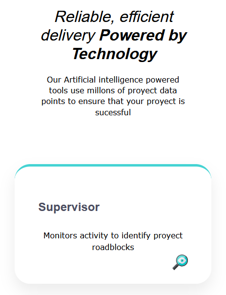
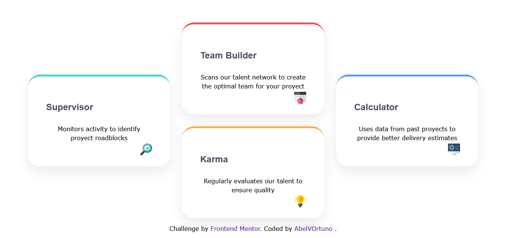

# Proyecto 02 - Four Card Feature Section # 

Seccion de caracteristicas desarrollada con **HTML y CSS (SASS)**, basada en un diseño tipo SASS.
El objetivo del proyecto fue construir un **layout no lineal en forma de cruz** , completamente responsive, utilizando **CSS Grid** de manera avanzada.

## Vista previa del sitio 

*Version en movil*

*Version laptop y PC*

## Tecnologias utilizadas ## 

- HTML5 semantico 
- CSS3
- `Display Grid` para diseños complejos
- Flexbox (para detalles internos)

## Objetivo del proyecto 

- Practicar **CSS Grid positioning** (`grid-column`, `grid-row`)

- Crear un layout no lineal,mas bien en cruzado
- Controlar alineacion y alturas dentro de un grid
- Mantener un diseño **responsive y limpio**
- Preparar un proyecto real para un portafolio profesional

## Layout y diseño 
El diseño principal utiliza un **grid de 3 columnas y 3 filas**, donde cada tarjeta es posicionada manualmente para formar una cruz:

- Tarjeta central superior
- Tarjeta central inferior
- Tarjetas laterales alineadas verticalmente

Se controlo el espacio vertical usando:

- `Grid-template-rows: min-content`
- `align-items: start`

Esto evito espacios innecesarios y permitio una composicion visual compacta y profesional.

## Responsive Design 

- **Desktop:** layout en forma de cruz usando CSS Grid
- **Tablet/Mobile:** las tarjetas se reorganizan en una sola columna
- Se eliminan posiciones fijas en breakpoints para evitar desbordes

## Caracteristicas destacadas 

- Layout avanzado con CSS Grid
- Uso correcto de variables CSS para estilos escalables
- Diseño fiel a una interfaz tipo SASS moderna
- Codigo limpio y facil de mantener
- Agregamos un par de animaciones al hacer click en las tarjetas

## Aprendizaje clave

- Diferencias entre posicionar con lineas y usar `span`
- Como evitar que las filas del grid se estiren innecesariamente
- Importancia de limitar el ancho del grid para mejorar la composicion visual

## Autor

**Abel Valverde Ortuno**

*Frontend Developer (Junior)*

- HTML | CSS | Animaciones al pasar el raton
- CSS Grid & Flexbox
- Git & GitHub
- Ramas de trabajo + Issues y PR tecnicos bien estructurados

## Notas 

Este proyecto forma parte de mi proceso de aprendizaje y de mi **portafolio personal**,enfocado a construir interfaces modernas, responsive y bien estructuradas. Es mi proyecto 02 de muchos mas que agregare a mi portafolio.

Cualquier feedback o sugerencia es bienvenido.
¡¡Estoy a sus ordenes!!